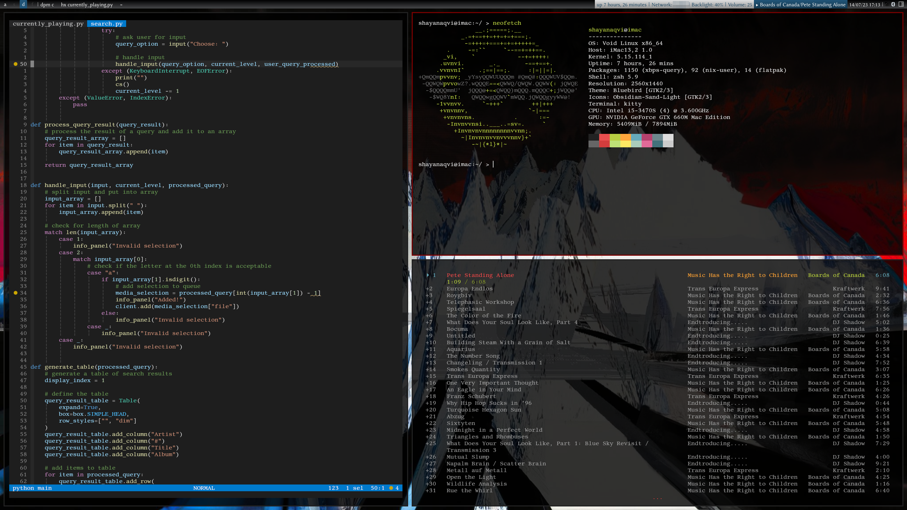
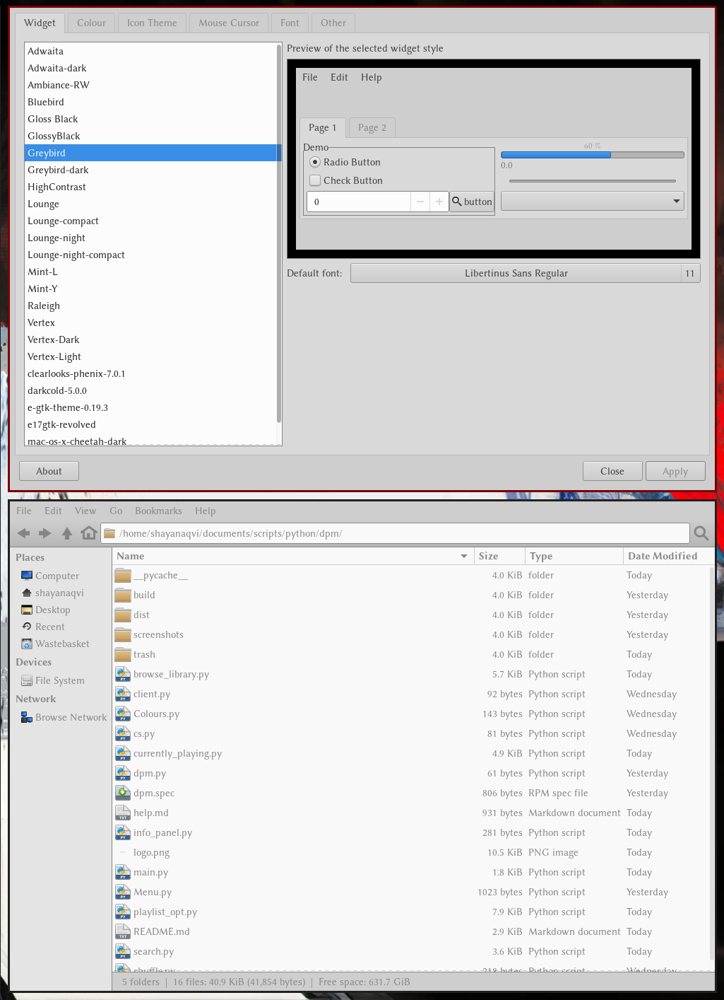
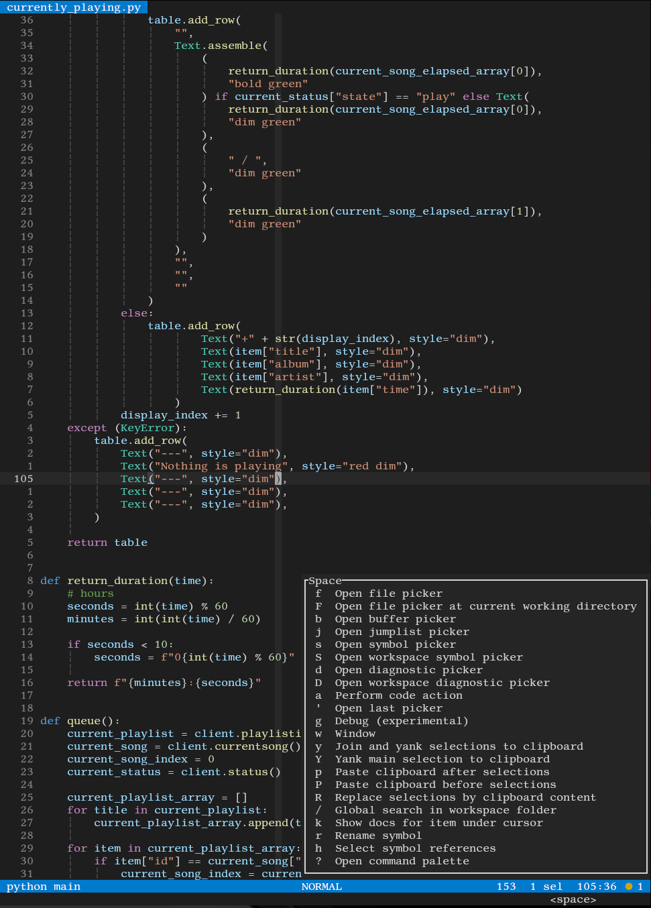
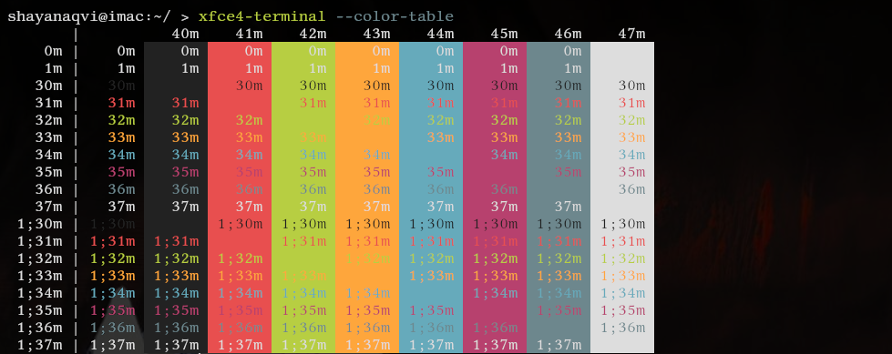

  
Hello!
This is a respository of dotfiles for (at present):
- Qtile
- Helix
- Kitty    
# Qtile
My configuration of qtile aims to look somewhat old-fashioned. It does not differ too much from the default configuration, consisting mostly of keybindings and modifications to layouts and the bar.  
The GTK theme used in this set up is the Greybird GTK theme. I am using the Kvantum theme of the same name for better consistency across apps. Wallpapers have been supplied. 
  
The font used with this theme is Libertinus Sans (link)
# Helix
Configurations here are not much (you can get pretty far with default Helix), but changes have been made to the bar, along with a few keybindings.
  
# Kitty
This configuration of kitty makes a few tweaks. A few keybindings have been changed. So has the colour scheme.  
  
Overall, configurations are kept fairly minimal here, however, I will (probably) keep updating this repository.
